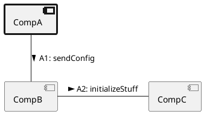

# hello-world
Hello world project

## Can we do PlantUML?

```plantuml
@startuml
skinparam {
    ComponentBorderThickness<<active>> 3
}
hide stereotype

[CompA] as ca <<active>>
[CompB] as cb
[CompC] as cc

ca -- cb : > A1: sendConfig
cb -r- cc : > A2: initializeStuff
@enduml
```
